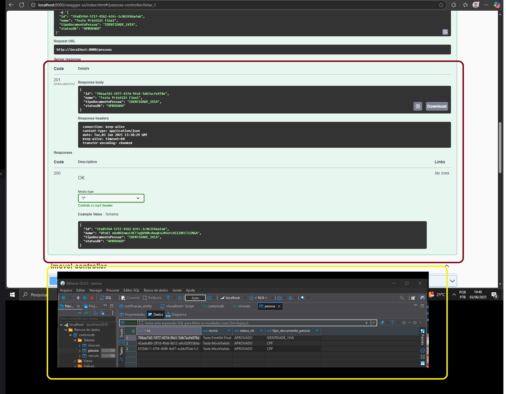
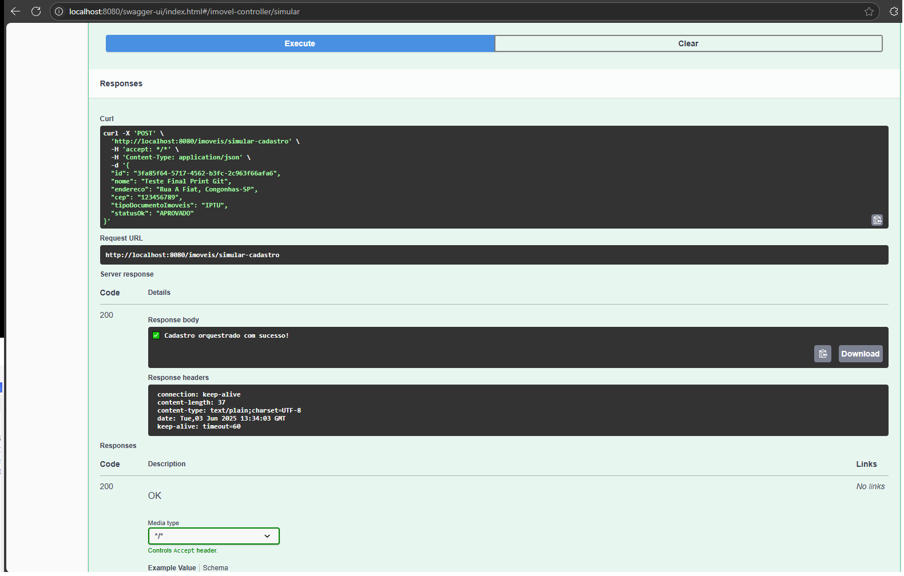
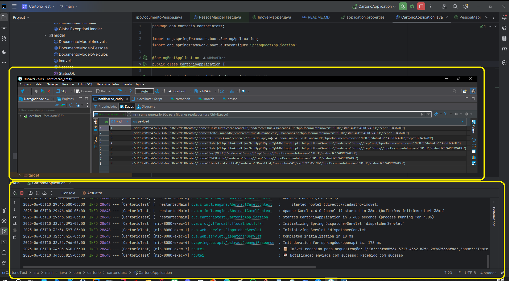
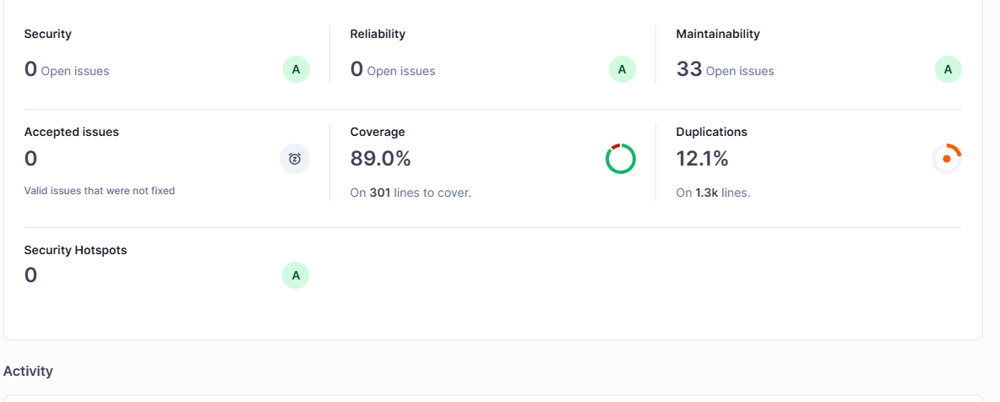

--
# 👋 Olá, eu sou Albino Pires!

- 🌐 Cloud Enthusiast | AWS Cloud | Spring Boot | Linux | Java Development | 
- 👨‍💻 BackEnd na GFT Brasil

## 🌐 Onde me encontrar

- [](https://www.linkedin.com/in/albino-pires-b188391b3/)
- [](mailto:albinofp34@gmail.com)

---

# 📚 Estudo JAVA com Spring Boot 💻

🛠️ Tecnologias Utilizadas 🧰
- Resumo:

         ✅ Java 17 |✅ Spring Boot |✅ JUnit 5 |✅ Maven |✅ IntelliJ IDEA |✅ Swagger |✅ SonarQube 
         ✅ Jacoco  |✅ Insommia    |✅ DBeaver 

- 📄 Descrições:

    * 👨‍💻 Java: Linguagem principal utilizada para o desenvolvimento do projeto.

    * ⚙️ Spring Boot: Framework que agiliza o desenvolvimento de aplicações Java, facilitando a configuração e implementação.

    * 🧪 Mockito: Ferramenta para criação de testes unitários, garantindo a qualidade e a confiabilidade do código.

    * 📄 Swagger: Utilizado para documentar a API REST, fornecendo uma interface interativa para testes e navegação dos endpoints.

    * 🧪 Insomnia: Aplicação utilizada para testar requisições HTTP aos endpoints da API de forma prática.

    * 📊 SonarQube: Plataforma de análise contínua que verifica qualidade de código, incluindo cobertura de testes e detecção de vulnerabilidades.

    * 📈 JaCoCo: Gera os relatórios de cobertura de testes utilizados pelo SonarQube.

    * 📊 DBeaver: Ferramenta poderosa e versátil para acessar e gerenciar bancos de dados.


---
⚙️ Funcionalidades 🔐

  - Endpoints organizados e documentados com Swagger, proporcionando fácil navegação e testes interativos da API.

  - Cobertura de testes unitários com JUnit e Mockito, validando a lógica de negócio de forma confiável.

  - Arquitetura modular, seguindo boas práticas de engenharia de software, com foco em:

    📄 DDD (Domain-Driven Design) para organização lógica por domínio.

    📄 DTOs e Mappers para separação entre camadas e transporte de dados.

    📄 Clean Code, garantindo legibilidade, manutenibilidade e padronização do projeto.


---
# 💻 Microservice com JAVA e Teste Unitario

- Visão Geral
O sistema é composto por um microserviço principal (CartorioTest) responsável por receber, processar e persistir dados de imóveis, com integração entre módulos utilizando Apache Camel e troca de mensagens simulada com o microserviço notificacaoMS.  
Ambos os microsserviços persistem os dados em bancos MariaDB distintos.


- 🔄 Integrações
  
  - Apache Camel: responsável por orquestrar a comunicação e roteamento interno dos dados simulando integração entre microsserviços.

  - NotificacaoMS: microserviço separado que recebe os dados enviados pelo Camel e também realiza a persistência em seu banco MariaDB.

  - Comunicação assíncrona simulada entre os serviços para testes de integração e estrutura de payload.


---

## 📄 Estrutura do Projeto

```
CartorioTest contém o documento abaixo com a arvore do projeto.

- estruturaProjeto.txt

```
## ✅ CRUD - Testando um cadastro persistido:

* Realizando no browser com swagger: http://localhost:8080/swagger-ui/index.html#/
    * Realize a inserção de dados;
    * Deve retornar um Status Code 201;


 


---
## ✅ CRUD - Testando Apache Camel:

* Realizando no browser com swagger: http://localhost:8080/swagger-ui/index.html#/
    * Realize um click na opção try out;
    * Deve retornar um Status Code 201;



## ✅ CRUD - Testando Apache Camel - Persistido:

    * DBeaver / MariaDB - Visualizando a persistência do Payload recebido;
    * Deve retornar um Status Code 201;





---

## 📄 Cobertura de Testes




---

## 📄 Objetivo

- 📦 DDD (Domain-Driven Design): para organização e modelagem de domínio.

- 🔁 DTOs e Mappers: separando entidades de transferência de dados e utilizando MapStruct para facilitar conversões.

- 🧪 Testes Unitários: garantindo o comportamento correto das classes com uso de JUnit 5 e Mockito.

- 🔄 Testes de Integração Simulada: verificando o fluxo completo entre serviços usando Apache Camel.

- ✅ Cobertura de Código: validada com Jacoco e SonarQube, assegurando a qualidade e confiabilidade da aplicação.

- 🧩 Arquitetura modular com separação de responsabilidades (Controller, Service, Repository, Model e Configuração de Roteamento).

- 🔀 Integração com Apache Camel: orquestrando o envio e consumo de mensagens entre microsserviços com rotas definidas e reutilizáveis.


---

## 🧪 Testando via Terminal

Você pode rodar os testes unitários diretamente no terminal e para gerar o relatório de cobertura de testes com JACoCo:

```bash
./mvn clean test
./mvn clean verify
```

Análise de Qualidade com SonarQube
Antes de rodar o SonarScanner, certifique-se que o SonarQube esteja ativo via Docker (veja abaixo). Em seguida, execute:

```bash
./docker run -d --name sonarqube \
  -p 9000:9000 \
  sonarqube

./sonar-scanner
```

Para rodar a aplicação localmente via Maven:

```bash
mvn spring-boot:run

```

---


## 🛠️Teste Unitário

```

1. Testes Unitários
Ferramenta: JUnit 5 + Mockito

Foco: Validação da lógica isolada das classes.

Todas as camadas testadas.

2. Testes de Integração
Verificam a comunicação entre as camadas e a integração com o banco MariaDB.

Garantem que as rotas com Apache Camel estão funcionando corretamente.

📌 Foram testadas:

Persistência real com banco de dados

Recebimento de payload do microserviço externo

Execução da lógica de negócio end-to-end

3. Testes de Cobertura
Ferramentas: JaCoCo + SonarQube

Objetivo: Avaliar a cobertura dos testes sobre o código-fonte.

Resultado: A cobertura foi analisada e validada com base nos relatórios gerados.


